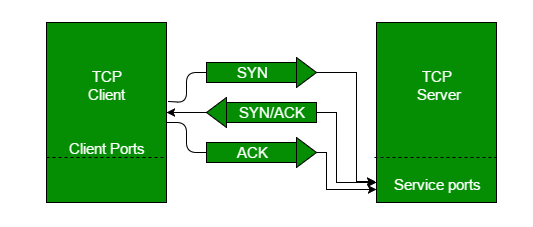
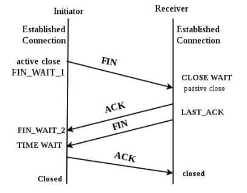
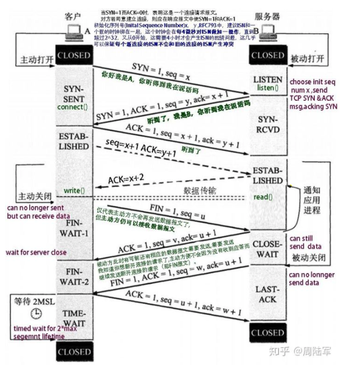

# Transmission Control Protocol 

### 3-way Handshake procesee

3 steps:
1. SYN include(SYN,SEQ)    Client -> Server
2. SYN + ACK  ACK(SYN,SEQ from client side) Server -> Client
3. ACK Client -> Server

The steps 1, 2 establish the connection parameter (sequence number) for one direction and it is acknowledged. The steps 2, 3 establish the connection parameter (sequence number) for the other direction and it is acknowledged. With these, a full-duplex communication is established.

### disconnection 

Step 1 (FIN From Client) – Suppose that the client application decides it wants to close the connection. (Note that the server could also choose to close the connection). This causes the client send a TCP segment with the FIN bit set to 1 to server and to enter the FIN_WAIT_1 state. While in the FIN_WAIT_1 state, the client waits for a TCP segment from the server with an acknowledgment (ACK).
Step 2 (ACK From Server) – When Server received FIN bit segment from Sender (Client), Server Immediately send acknowledgement (ACK) segment to the Sender (Client).
Step 3 (Client waiting) – While in the FIN_WAIT_1 state, the client waits for a TCP segment from the server with an acknowledgment. When it receives this segment, the client enters the FIN_WAIT_2 state. While in the FIN_WAIT_2 state, the client waits for another segment from the server with the FIN bit set to 1.
Step 4 (FIN from Server) – Server sends FIN bit segment to the Sender(Client) after some time when Server send the ACK segment (because of some closing process in the Server).
Step 5 (ACK from Client) – When Client receive FIN bit segment from the Server, the client acknowledges the server’s segment and enters the TIME_WAIT state. The TIME_WAIT state lets the client resend the final acknowledgment in case the ACK is lost.The time spent by client in the TIME_WAIT state is depend on their implementation, but their typical values are 30 seconds, 1 minute, and 2 minutes. After the wait, the connection formally closes and all resources on the client side (including port numbers and buffer data) are released.
In the below Figur

