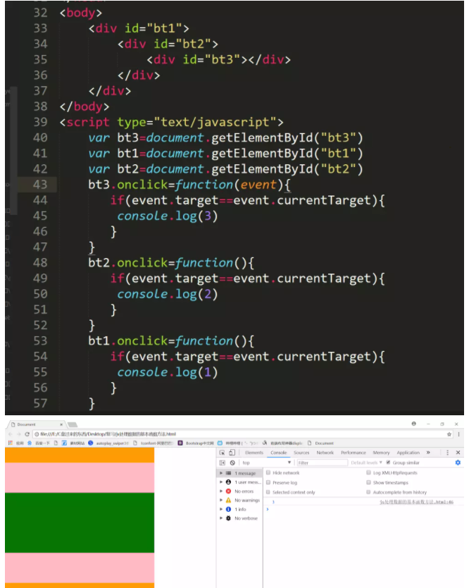

### event delegation 
----
Event delegation is a technique involving adding event listener to a parent element instead of descendant elements

Due to the bubbling in DOM, the listener will fire whenever the event is triggerd on the descendant elements.

benefits:
    - save memory, because there is only one listener in the parent element. you    don't need to add event listener for each descendants elements
    - you dont need to unbind/bind the listener form the descendant elements which need to be deleted/added

regular: 
``` js
<div id="box">
        <input type="button" id="add" value="添加" />
        <input type="button" id="remove" value="删除" />
        <input type="button" id="move" value="移动" />
        <input type="button" id="select" value="选择" />
</div>

window.onload = function(){
            var Add = document.getElementById("add");
            var Remove = document.getElementById("remove");
            var Move = document.getElementById("move");
            var Select = document.getElementById("select");
            
            Add.onclick = function(){
                alert('添加');
            };
            Remove.onclick = function(){
                alert('删除');
            };
            Move.onclick = function(){
                alert('移动');
            };
            Select.onclick = function(){
                alert('选择');
            }
            
        }
```
event delegation

```js
window.onload = function(){
            var Add = document.getElementById("add");
            var Remove = document.getElementById("remove");
            var Move = document.getElementById("move");
            var Select = document.getElementById("select");
            
            Add.onclick = function(){
                alert('添加');
            };
            Remove.onclick = function(){
                alert('删除');
            };
            Move.onclick = function(){
                alert('移动');
            };
            Select.onclick = function(){
                alert('选择');
            }
            
        }

```
### bubbling and capturing 
bubble up   capture down 
With bubbling, the event is first captured and handled by the innermost element and then propagated to outer elements.

With capturing, the event is first captured by the outermost element and propagated to the inner elements.

``` JS
elem.addEventListener(...{capture:true})
elem.addEventListener(...true)
// If it’s false (default), then the handler is set on the bubbling phase.
// If it’s true, then the handler is set on the capturing phase.
```


### prevent event bubbling 
---
1. add  event.stopPropagation()
```js
    $('div').mousedown(function(e){
        var e = event || window.event
         event.stopPropagation()
    })
```
2. set false in handler
return false not only stoped ths event bubbling but also stoped the event  itself
```js
  $('div').mousedown(function(e){
        var e = event || window.event
         return false
    })
```
3. event.target == event.currentTarget 

**currentTarget始终是监听事件者，而target是事件的真正发出者**


### prevent default event
1. event.preventDefault()
2. return false 