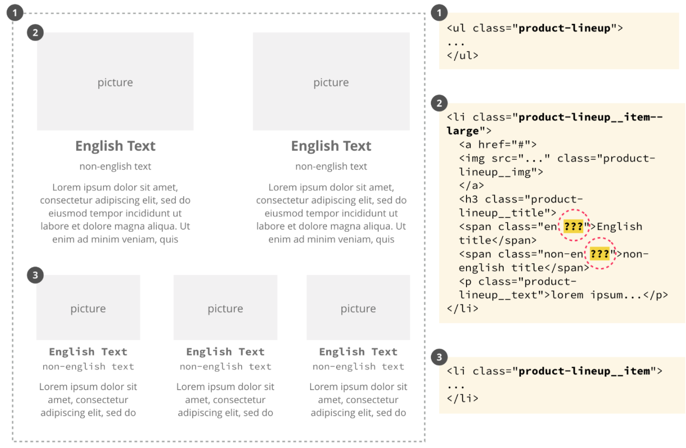

# What is BEM 
BEM is an abbreviation of (block element modifier), which is a naming methodology 

- -: use for connecting words  
- __: use for connecting element
- --: use for modifier


### How to handle nested elements 

```HTML
<ul class="lineup">
  <li class="lineup__item product">
    
    <h3 class="product__title">…</h3>
    <div class="product__text">…</div>
  </li>
  …
</ul>
```

### How to structure file

```
search-form/                           # Directory of the search-form

    __input/                           # Subdirectory of the search-form__input
        search-form__input.css         # CSS implementation of the
                                       # search-form__input element
        search-form__input.js          # JavaScript implementation of the
                                       # search-form__input element

    __button/                          # Subdirectory of the search-form__button element
        search-form__button.css
        search-form__button.js

    _theme/                            # Subdirectory of the search-form_theme modifier
        search-form_theme_islands.css  # CSS implementation of the search-form block
                                       # that has the theme modifier with the value
                                       # islands
        search-form_theme_lite.css     # CSS implementation of the search-form block
                                       # that has the theme modifier with the value
                                       # lite

search-form.css                        # CSS implementation of the search-form block
search-form.js                         # JavaScript implementation of the
                                       # search-form block
```


### ref
https://stackoverflow.com/questions/55292055/bem-naming-convention-for-nested-tiny-parts