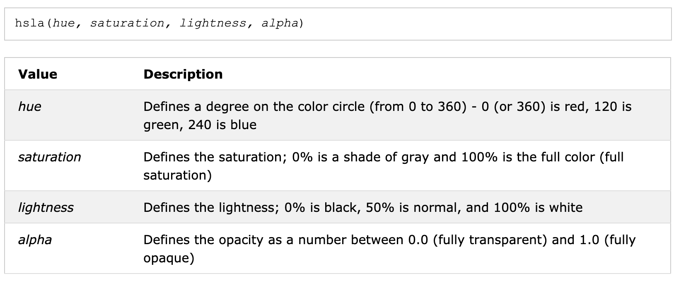

### 




```
body, main::before { background: url("tiger.jpg") 0 / cover fixed; } 
main { 
    position: relative; 
    background: hsla(0,0%,100%,.3);  //  hsla --- Hue-saturation-lightness-alpha model 
}
main::before { 
    content: ''; 
    position: absolute; top: 0; right: 0; bottom: 0; left: 0; 
    filter: blur(20px); 
    margin: -30px; //  let pseduo element larger than it's element so the region near the
                    // boarder is blured as well 
    }
```

https://www.cnblogs.com/xiaohuochai/p/7511823.html