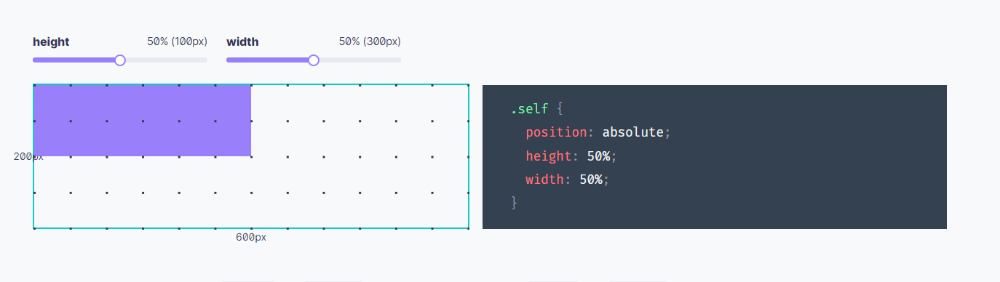
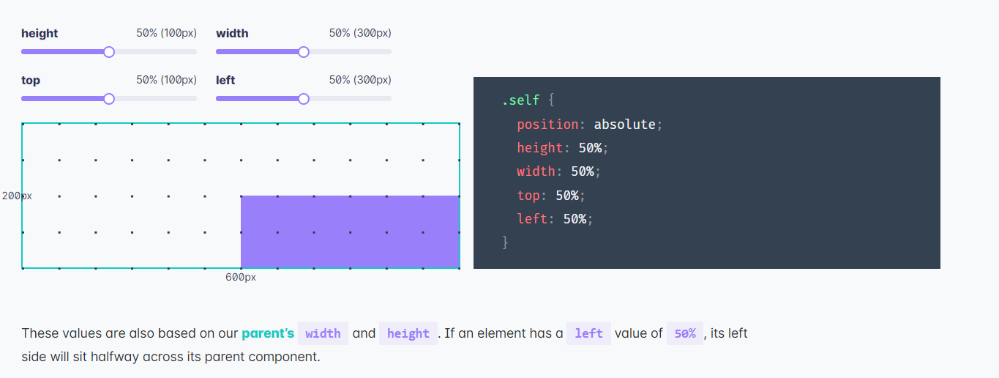
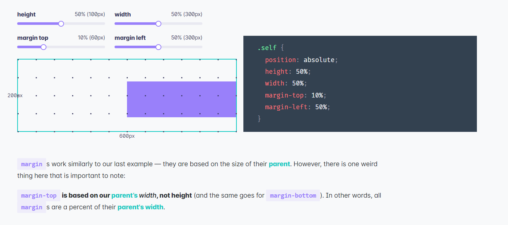
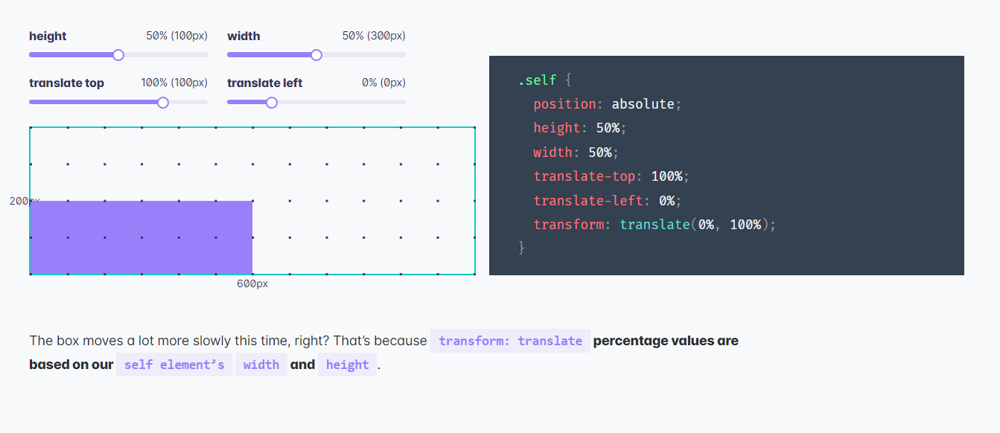

##  Based on parent’s width and height

element’s width and height are based on our parent’s width and height (respectively).

  1. width & height
  

  2. top & left 
  

## Based on parent’s width

all margins are a percent of their parent's width.

  1. margin
  

  2.padding 

## Based on it self 

percentage values are based on our self element’s width and height

  1. transform 
  