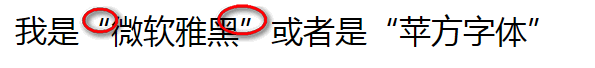
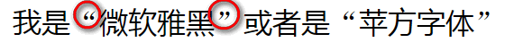
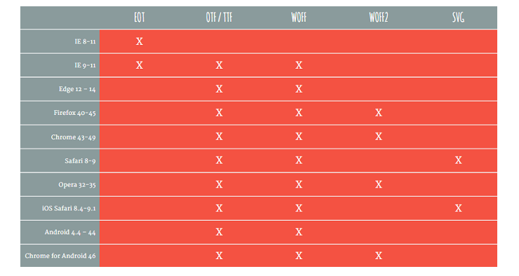

### vue  font setting


在font.css里
```css
@font-face{
    font-family: 'pf'  // css 变量   重命名字体名
    src:url('PingFang.ttf') //引入字体 可以是本地的也可以是线上的地址
    font-weight : normal  //字体粗细
    font-style : normal //  还可以设置 itali 之类
}
```

在app.vue 中引入字体全局修改

如果想单独修改则在对应的class里写
```css
.class{
    font-family: pf
}
```


### 详解@font face

- src 
  - 优化. 如果本地有此字体则用本地的,否则外部加载
```css
  @font-face {
  font-family: FZCYS;
  src: local("FZYaSongS-B-GB"), 
       url("FZCYS.woff2"),  
       url("FZCYS.woff"),
       url("FZCYS.ttf");
}
```
  - font-style  设置在不同style 下用的字体
```css
  @font-face {
  font-family: 'I';
  font-style: normal;
  src: local('FZYaoti');
}
@font-face {
  font-family: 'I';
  font-style: italic;
  src: local('FZShuTi');
}
 ```
  - unicode-range 指定特殊字符用特定的字体

```
@font-face {
  font-family: 'I';
  font-style: normal;
  src: local('FZYaoti');
}
@font-face {
  font-family: 'I';
  font-style: italic;
  src: local('FZShuTi');
}
```




### use @import 
from GoogleFonts
直接引入
优点: 不用自己去维护font-face
``` CSS
@import url('https://fonts.googleapis.com/css2?family=Lemonada:wght@300&display=swap');

font-family: 'Lemonada', cursive;
```


### 字体格式
不同的浏览器支持不同格式的字体


- ttf
- otf
- eot
- woff
- svg
  