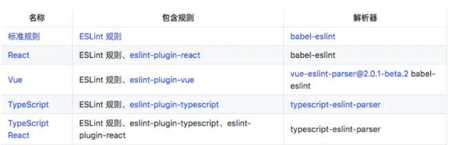

### esLint
主要功能是代码语法的校验
在没有prettier之前用exlint -fix 来进行代码格式化
### prettier
主要功能是代码风格的校验,例如 单行代码长度,tab 长度等等


### 方法
解决办法是：

- 使用 editorconfig 协助兼容开发工具的代码格式化。
- 使用 eslint 检查代码。
- 使用 prettier 格式化代码。（可以理解为 prettier 是 eslint —fix 的加强版，用 prettier 来代替 eslint-fix）
- 手动修改剩下的有问题的地方，或者有些地方很难用规则来判断的时候，就需要手动修改。


#### 一些插件

- eslint-config-prettier
这个插件是如果 eslint 的规则和 prettier 的规则发生冲突的时候（主要是不必要的冲突），例如 eslint 限制了必须单引号，prettier 也限制了必须单引号，那么如果用 eslint 驱动 prettier 来做代码检查的话，就会提示 2 种报错，虽然他们都指向同一种代码错误，这个时候就会由这个插件来关闭掉额外的报错。
但如果是 eslint 只负责检测代码，prettier 只负责格式化代码，那么他们之间互不干扰，也就是说，也是可以不安装这个插件的，但是因为团队的人员的差异性（即使同一个开发工具也有版本差异，也有使用 prettier 和 eslint 的差异），可能有存在各种情况，所以最好还是安装上这个插件。

- babel-eslint ：
有些代码是没被 eslint 支持的（因为 babel 也是负责这种事情，转译不被支持的 js 语法），所以需要加上这个插件来保持兼容性。
官方有详细介绍：github.com/babel/babel…

- eslint-plugin-html：
为了让 eslint 可以检查.vue文件的代码。


### eslint 配置
不同的文件有不同的配置文件 格式


.eslintrc 添加需要修改的地方,主要是为了prettier插件和eslint-config-prettier插件和eslint-plugin-prettier 插件使用的

``` JS
// 因为使用了 eslint 和 prettier，所以要加上他们
extends: [ 'eslint:recommended', 'plugin:prettier/recommended'],

// required to lint *.vue files 使用 html参数
plugins: ['html', 'prettier'],

// rules 规则就按照各家写法。
```

### prettier 配置
prettier 的检查规则是通过配置文件.prettierrc 实现的
``` JS
{
  "printWidth": 100,
  "singleQuote": true,
  "semi": false
}
```
有可能会出现的情况是，prettier 格式化后，全部加了分号，但是 eslint 又要去掉分号，那么就会重复了，这里可以简单地设置 prettier 的分号设置跟 eslint 保持一致

### editorconfig 配置
EditorConfig 可以帮助开发者在不同的编辑器和 IDE 之间定义和维护一致的代码风格。
EditorConfig 包含一个用于定义代码格式的文件和一批编辑器插件，这些插件可以让编辑器读取配置文件并依此格式化代码。