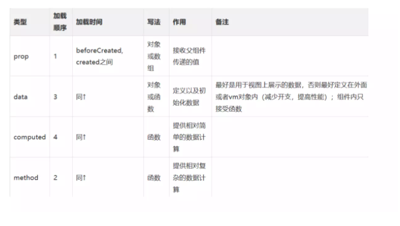

### Vue各阶段数据可使用情况：created，computed，data，prop，mounted，methods，watch

created时，可用data和prop中的数据。
computed的属性，当在mounted或者dom中使用到时，才会属性的执行代码。
最后是mouted，可使用前面的数据，并且此时才可以操作dom。
watch不会再创建阶段自动执行，除了添加立即执行这个配置项。





1.在new Vue（）的时候，vue\src\core\instance\index.js里面的_init()初始化各个功能
```
function Vue (options) {
if (process.env.NODE_ENV !== 'production' &&
  !(this instanceof Vue)
) {
  warn('Vue is a constructor and should be called with the `new` keyword')
}
this._init(options) //初始化各个功能
}
```
在_init()中有这样的一个执行顺序：其中initState()是在beforeCreate和created之间
```
  initLifecycle(vm)
  initEvents(vm)
  initRender(vm)
  callHook(vm, 'beforeCreate')
  initInjections(vm) // resolve injections before data/props
  initState(vm) //初始化
  initProvide(vm) // resolve provide after data/props
  callHook(vm, 'created') 
```  


在initState()做了这些事情：
```
if (opts.props) initProps(vm, opts.props)//初始化Props
if (opts.methods) initMethods(vm, opts.methods)//初始化methods
if (opts.data) {
  initData(vm)} else {
  observe(vm._data = {}, true /* asRootData */)}//初始化data
if (opts.computed) initComputed(vm, opts.computed)//初始化computed
```

所以Props，methods,data和computed的初始化都是在beforeCreated和created之间完成的。
