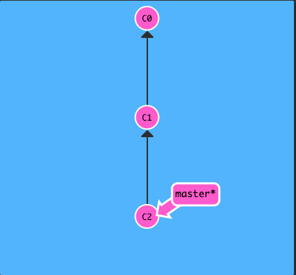
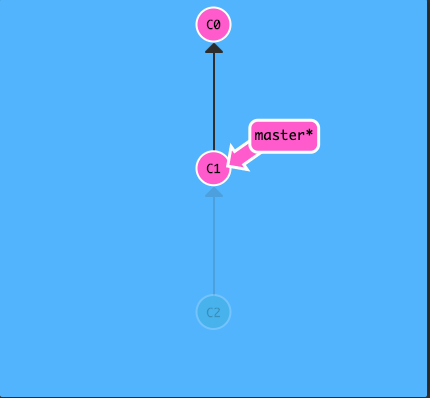
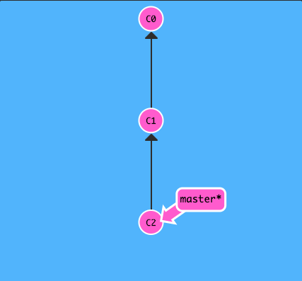
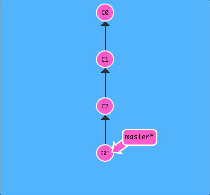

git reset HEAD~1 

Git 把 master 分支移回到 C1；现在我们的本地代码库根本就不知道有 C2 这个提交了。
在reset后， C2 所做的变更还在，但是处于未加入暂存区状态。

虽然在你的本地分支中使用 git reset 很方便，但是这种“改写历史”的方法对大家一起使用的远程分支是无效的

为了撤销更改并分享给别人，我们需要使用 git revert

git revert HEAD

 

奇怪！在我们要撤销的提交记录后面居然多了一个新提交！这是因为新提交记录 C2' 引入了更改 —— 这些更改刚好是用来撤销 C2 这个提交的。也就是说 C2' 的状态与 C1 是相同的。

revert 之后就可以把你的更改推送到远程仓库与别人分享啦。