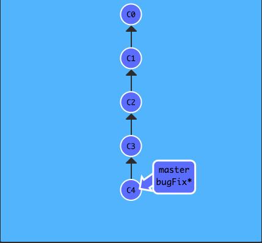
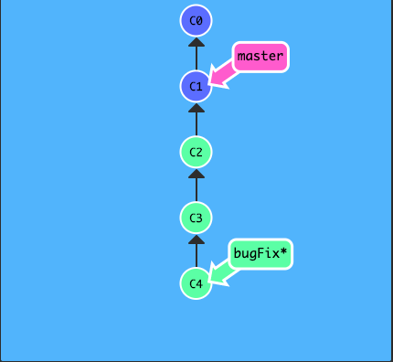
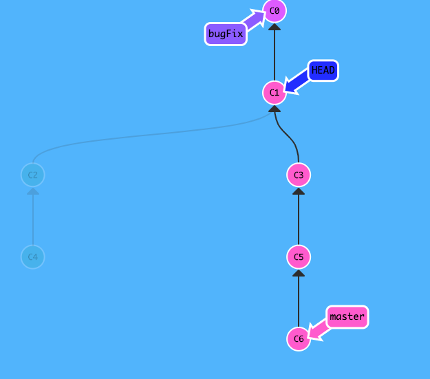
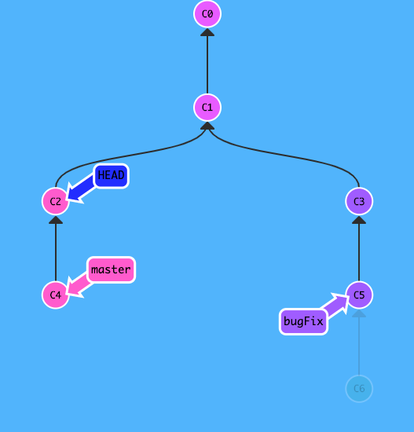

git branch -f master HEAD~3

-f allow us to move the branch forced

我使用相对引用最多的就是移动分支。可以直接使用 -f 选项让分支指向另一个提交。例如:

git branch -f master HEAD~3

上面的命令会将 master 分支强制指向 HEAD 的第 3 级父提交。

target

current

git branch -f master C6
git checkout -f bugFix HEAD~1