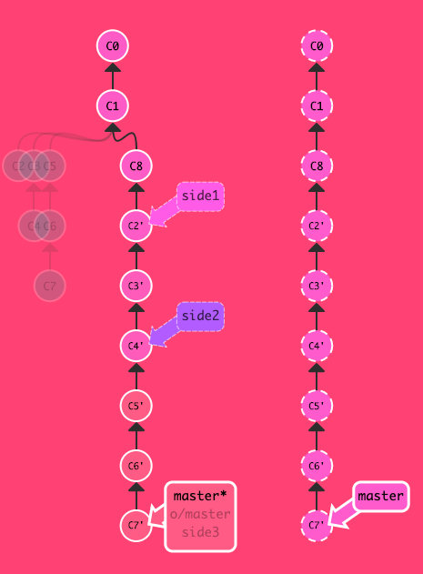
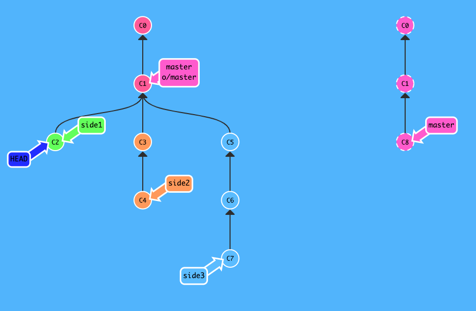

target

current

git fetch 
git rebase o/master side1      rebase  (current usuallyIsOldBranch  new/current Branch) 
                                after rebase the head is point to the current Branch  
git rebase side1 side2
git rebase side2 side3
git rebase side3 master