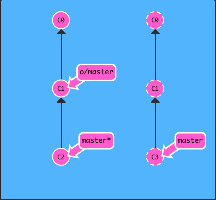
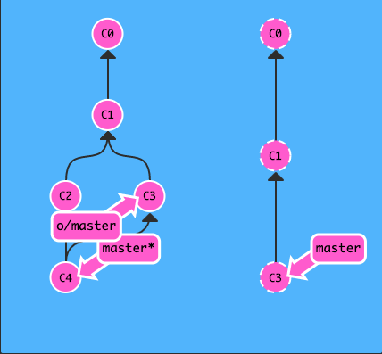

其实有很多方法的 —— 当远程分支中有新的提交时，你可以像合并本地分支那样来合并远程分支。也就是说就是你可以执行以下命令:

git cherry-pick o/master
git rebase o/master
git merge o/master

等等
实际上，由于先抓取更新再合并到本地分支这个流程很常用，因此 Git 提供了一个专门的命令来完成这两个操作。它就是我们要讲的 git pull。

git fetch 
git merge o/master

or

git pull

