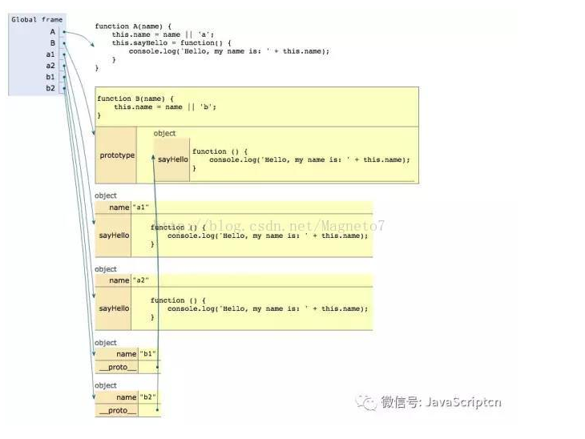

``` JS
// 构造函数A

function A(name) {

   this.name = name || 'a';

   this.sayHello = function() {

       console.log('Hello, my name is: ' + this.name);

   }

}

 

// 构造函数B

function B(name) {

   this.name = name || 'b';

}

B.prototype.sayHello = function() {

   console.log('Hello, my name is: ' + this.name);

};

 

var a1 = new A('a1');

var a2 = new A('a2');

a1.sayHello();

a2.sayHello();

 

var b1 = new B('b1');

var b2 = new B('b2');

b1.sayHello();

b2.sayHello();

```


定义在构造函数内部的方法,会在它的每一个实例上都克隆这个方法;定义在构造函数的prototype属性上的方法会让它的所有示例都共享这个方法,但是不会在每个实例的内部重新定义这个方法. 
如果我们的应用需要创建很多新的对象,并且这些对象还有许多的方法,为了节省内存,我们建议把这些方法都定义在构造函数的prototype属性上

另外,需要注意的一些地方: 
如果是在函数的prototype属性上定义方法的话,要牢记一点,如果你改变某个方法,那么由这个构造函数产生的所有对象的那个方法都会被改变. 