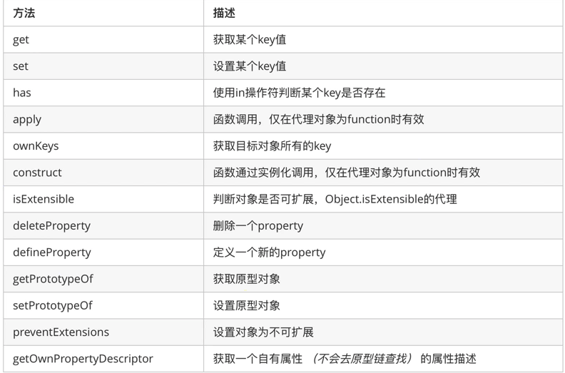

### proxy

组成: 
- target
- traps  (rules are defined in handler)
- handler

应用:
- [proxy](#proxy)
	- [validation](#validation)
	- [side effect](#side-effect)
	- [caching](#caching)


``` JS

//movie is a target
const movie = {
	name: "Pulp Fiction",
	director: "Quentin Tarantino"
};

//this is a handler
const handler = {
	//get is a trap
	get: (target, prop) => {
		if (prop === 'director') {
			return 'God'
		}
		return target[prop]
	},

	set: function (target, prop, value) {
		if (prop === 'actor') {
			target[prop] = 'John Travolta'
		} else {
			target[prop] = value
		}
	}
};

const movieProxy = new Proxy(movie, handler);

console.log(movieProxy.director); //God

movieProxy.actor = "Tim Roth";
movieProxy.actress = "Uma Thurman";

console.log(movieProxy.actor); //John Travolta
console.log(movieProxy.actress); //Uma Thurman

```


#### validation
``` JS
const handler = {
	set: function (target, prop, value) {
		const houses = ['Stark', 'Lannister'];
		if (prop === 'house' && !(houses.includes(value))) {
			throw new Error(`House ${value} does not belong to allowed ${houses}`)
		}
		target[prop] = value
	}
};

const gotCharacter = new Proxy({}, handler);

gotCharacter.name = "Jamie";
gotCharacter.house = "Lannister";

console.log(gotCharacter);

gotCharacter.name = "Oberyn";
gotCharacter.house = "Martell";

```

运行结果如下:
{ name: 'Jamie', house: 'Lannister' }
Error: House Martell does not belong to allowed Stark,Lannister
复制代码上面这个例子中, 我们严格限制了house这个属性所能被赋予的值的范围. 只需要创建一个set的trap, 我们甚至能用这个实现方式来实现一个只读的对象.

#### side effect

``` JS
const sendEmail = () => {
	console.log("sending email after task completion")
};


const handler = {
	set: function (target, prop, value) {
		if (prop === 'status' && value === 'complete') {
			sendEmail()
		}
		target[prop] = value
	}
};

const tasks = new Proxy({}, handler);

tasks.status = "complete";

```

#### caching

``` JS
const cacheTarget = (target, ttl = 60) => {
	const CREATED_AT = Date.now();
	const isExpired = () => (Date.now() - CREATED_AT) > (ttl * 1000);
	const handler = {
		get: (target, prop) => isExpired() ? undefined : target[prop]
	};
	return new Proxy(target, handler)
};

const cache = cacheTarget({age: 25}, 5);

console.log(cache.age);   // 25

setTimeout(() => {
	console.log(cache.age)  //undefined
}, 6 * 1000);

```
这里我们创建了一个函数, 并返回一个Proxy. 在获取target的属性前, 这个Proxy的handler首先会检查target对象是否过期. 基于此, 我们可以针对每个键值都设置一个基于TTLs或者其他机制的过期检查


缺点
虽然Proxy具备一些很神奇的功能, 但在使用时仍然具有一些不得不小心应对的限制:

- 性能会受到显著的影响. 在注重性能的代码中应该避免对Proxy的使用
- 没有办法区分判断一个对象是一个Proxy的对象或者是target的对象
- Proxy可能会导致代码在可读性上面出现问题

Proxy有13种数据劫持的操作:
