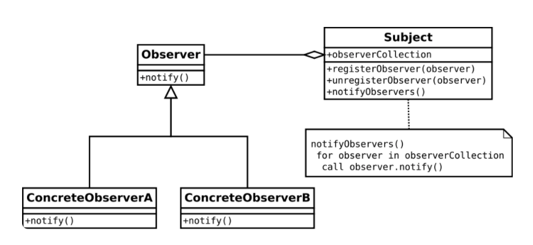

``` JS
 var Subject = function(){
     this.observes = []

     return {
         subscribeObserver: function (observer) {
             this.observers,push(observer)
           }

         unsubscribeObserver: function (observer) { 
            var index = this.observers.indexOf(observer)
            if(index> -1){
                this.observers.splice(index,1)
            }
         }

         notifiyObserver: function (observer) {
             var index = this.observers.indexOf(observer);
            if(index > -1) {
                this.observers[index].notify(index);
            }
        }
     }
 }


 var Observer = function () {
     return {
         notify: function (index) { 
             console.log("Observer " + index + " is notified!");
          }
     }
   }


var subject = new Subject();

var observer1 = new Observer();
var observer2 = new Observer();

subject.subscribeObserver(observer1);
subject.subscribeObserver(observer2);

subject.notifyObserver(observer2); // Observer 2 is notified!
```
