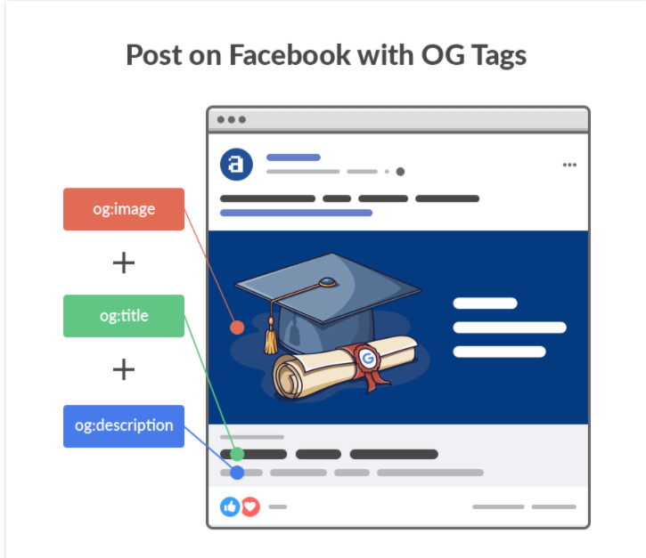

### apple-touch-icon
``` HTML
<link rel="apple-touch-icon" href="/custom_icon.png"/> 
```
this property is for ios devices, so that the Safari on iphone, ipad, etc. could add the website on home page for later visit.


#### size property
size is for different devices.

- 57 x 57 (default) (320x640)
- 72 x 72 (ipad)
- 114 x 114 (retina)
- 144 x 144 (ipad3)

document: 
For iPhone and iPod touch both of these sizes are required:

57 x 57 pixels

114 x 114 pixels (high resolution)

For iPad, both of these sizes are required:

72 x 72 pixels

144 x 144 (high resolution)

so we should have 
``` HTML
<link rel="apple-touch-icon" sizes="57x57" href="touch-icon-iphone.png" />
<link rel="apple-touch-icon" sizes="72x72" href="touch-icon-ipad.png" />
<link rel="apple-touch-icon" sizes="114x114" href="touch-icon-iphone4.png" />  
<link rel="apple-touch-icon" sizes="144x144" href="apple-touch-icon-ipad3-144.png" />
```


### Open Graph meta tag
Open Graph meta tags are snippets of code that control how URLs are displayed when shared on social media. 
They’re part of Facebook’s Open Graph protocol and are also used by other social media sites, including LinkedIn and Twitter (if Twitter Cards are absent).

``` HTML
<meta property="og:title" content="How to Become an SEO Expert (8 Steps)" />
<meta property="og:description" content="Get from SEO newbie to SEO pro in 8 simple steps." />
<meta property="og:image" content="https://ahrefs.com/blog/wp-content/uploads/2019/12/fb-how-to-become-an-seo-expert.png" />
```


#### why we need this tag 
People are arguably more likely to see and click shared content with optimized OG tags, which means more social media traffic to your website.

#### 17 OG tags
[documnet](https://developers.facebook.com/docs/sharing/webmasters/)