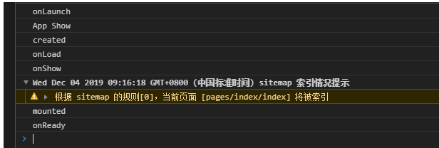

### page lifecycle 
---
page lifecycle 只在pages目录下的文件生效

- onLoad executed once (页面初始化)
- onReady executed once (页面加载完毕)
- onShow executed  multiple times (页面进入执行)
- onHide executed  multiple times (页面离开)
- onResize
- onPullDownRefresh 
  - 在 js 中定义 onPullDownRefresh 处理函数（和onLoad等生命周期函数同级），监听该页面用户下拉刷新事件。需要在 pages.json 里，找到的当前页面的pages节点，并在 style 选项中开启 enablePullDownRefresh。当处理完数据刷新后，uni.stopPullDownRefresh 可以停止当前页面的下拉刷新。
- onReachBottom
- onTabItemTap  监听触动tabbar

### 关于uniapp 和vue 生命周期的执行顺序
---

App.vue  页面周期

onShow: function() {//当 uni-app 启动，或从后台进入前台显示
            console.log('App Show')
},

onLaunch:function(){//当uni-app 初始化完成时触发（全局只触发一次）

           console.log('App onLaunch')

}

页面中的生命周期函数:

onReady(){//监听页面初次渲染完成。注意如果渲染速度快，会在页面进入动画完成前触发
            console.log('onReady');            
 },
created() {//vue生命周期  页面创建时调用
            console.log('created');
},
onShow(){//监听页面显示。页面每次出现在屏幕上都触发，包括从下级页面点返回露出当前页面
            console.log('onShow');
 },
onLoad() {//监听页面加载，其参数为上个页面传递的数据，参数类型为Object（用于页面传参

             console.log('onLoad');

 },
mounted() {//vue 生命周期 ,html挂载的时候 调用
            console.log('mounted');
},
